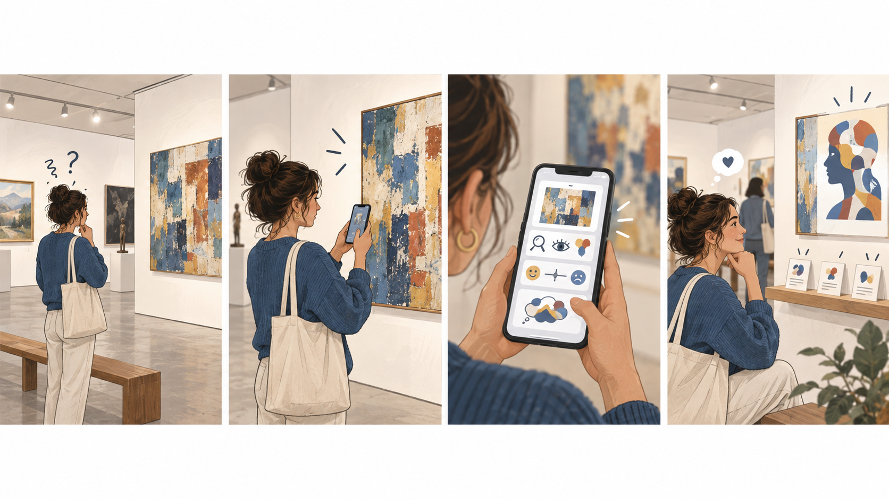
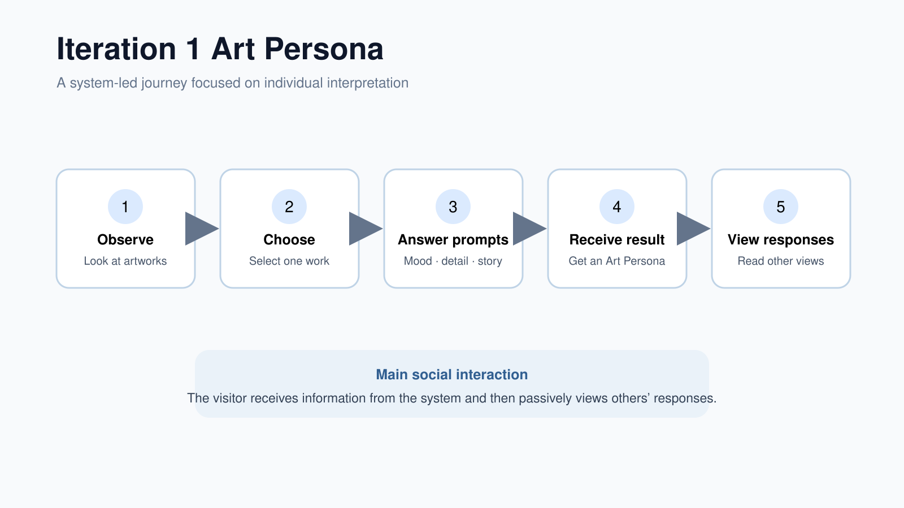

# Design Iteration 1: Art Persona

*Initial concept and early concept testing*

## Design Focus

This iteration explored how a short mobile activity could help casual and inexperienced gallery visitors form a personal interpretation of an artwork. The concept responded to visitors who may rely on wall labels, feel uncertain about their own interpretation, or struggle to begin a conversation about art.

## Initial Concept

The Art Persona concept used playful, artwork-specific prompts instead of testing visitors on art history. One example asked, “If you were a master art thief, which artwork would you choose?” The participant would select an artwork, answer a small number of questions about the details, mood, or story that attracted them, and receive an Art Persona based on those responses.

The result was intended to reassure visitors that personal reactions are valid and to provide an accessible starting point for discussing art.

### Scenario

*Figure 1. A visitor observes artworks, selects one, answers playful prompts, and receives an Art Persona.*

### Initial Interaction Flow

*Figure 2. The initial Art Persona interaction flow.*

## Proposed Interaction

| Stage | Visitor Action | Purpose |
| --- | --- | --- |
| Observe | Look at several physical artworks before using the interface. | Keep the artwork central to the visit. |
| Choose | Select the artwork that creates the strongest personal response. | Give the visitor an easy entry point. |
| Respond | Answer short questions about visual details, emotion, or an imagined story. | Support personal interpretation without a correct answer. |
| Result | Receive a short Art Persona description. | Reflect the visitor's choices back to them. |
| Compare | View selected responses from other visitors. | Introduce a social layer. |

## Early Persona Testing

The early testing focused on whether participants could understand the Art Persona idea, whether the prompts encouraged them to look at the artwork, and whether they were interested in seeing other visitors' responses. The testing also examined whether the activity felt playful or whether it felt like a quiz.

The testing questions included:

- Can participants understand the purpose without an explanation from the design team?
- Do the questions support observation of the physical artwork?
- Does the Persona result feel connected to the participant's choices?
- Are participants comfortable sharing their response anonymously?
- Does viewing another person's response encourage further reflection?

## Limitations Identified

The concept supported individual reflection, but the social interaction remained weak. A participant could complete the activity, receive a result, and leave without another visitor affecting how they moved through or observed the gallery. The Persona could also feel predetermined or superficial if it reduced a complex interpretation to a fixed category.

Displaying other visitors' comments added social information, but it still positioned the user as a passive reader. It did not give visitors a clear reason to respond to one another or return their attention to a specific physical artwork.

## Design Decision

We retained three useful elements from this iteration: playful prompts, personal interpretation without a correct answer, and anonymous access to other visitors' perspectives. We then changed the main interaction. Instead of asking the system to classify the visitor, the next iteration allows one visitor's observation to shape another visitor's route and attention inside the gallery. This decision led to Borrowed Eyes.

*Figure 3. Art Persona is a system-led and mainly individual experience.*

*Figure 4. Borrowed Eyes turns the experience into a visitor-led cumulative social loop.*
