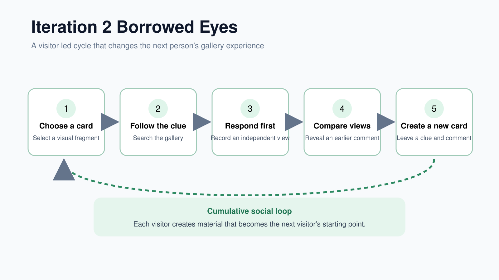
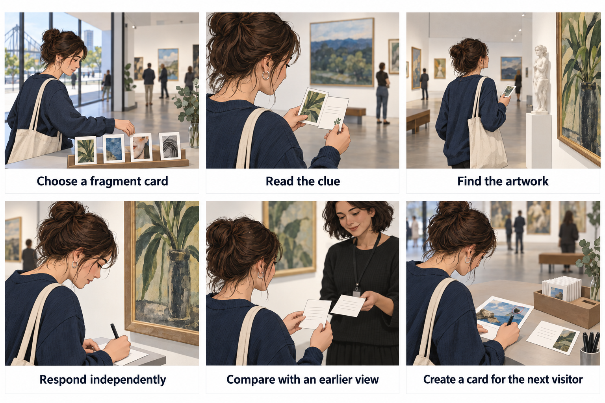

# Design Iteration 2: Borrowed Eyes

*Current concept and paper prototype development*

## Current Design Direction

Borrowed Eyes is a cumulative, visitor-generated gallery experience designed to strengthen both visitor–artwork and visitor–visitor connections. Instead of giving visitors expert explanations or asking them knowledge-based questions, the project allows one visitor’s observation to guide how another visitor explores and interprets the gallery.

The concept is based on a simple idea:

One visitor leaves a way of looking, and the next visitor temporarily experiences the gallery through their eyes.

## Design value

Borrowed Eyes is intended to achieve five main outcomes:

Encourage closer observation
Visual fragments and clues give visitors a specific reason to inspect artworks carefully.
Support interpretive confidence
Participants respond before receiving expert information or other visitors’ opinions, reinforcing the idea that their personal interpretation has value.
Create low-pressure social connection
Visitors can exchange perspectives anonymously without needing to approach or speak directly to strangers.
Keep physical artworks central
The interaction requires participants to move through the gallery and look at the artworks rather than spending the entire experience focused on a screen.
Allow the experience to evolve
The content is not completely produced in advance. Each participant adds new material, making the experience richer and more varied over time.

## Prototype Materials

| Material | Content | When It Is Shown |
| --- | --- | --- |
| Card | A cropped detail from an artwork. It does not show the title, artist, or complete work. | Before the search |
| Clue | A few words or a short phrase that supports the search without revealing the answer. | Before the search |
| Comment | A previous visitor's personal interpretation of the selected detail. | After the current participant records an independent response |

## Core Interaction

*Figure 1. The Borrowed Eyes interaction changes from a linear activity into a cumulative social loop.*

The interaction follows six stages:

1. Choose a fragment card.
2. Read the clue.
3. Find the artwork.
4. Respond independently.
5. Compare views.
6. Create a new card.

The order is important. The participant records an initial response before seeing the earlier comment. This reduces the influence of the previous visitor's interpretation and allows the team to compare two independent ways of seeing the same detail.

### Scenario

*Figure 2. A participant follows a previous visitor's clue, records an independent response, compares perspectives, and creates a card for the next visitor.*

## Paper Prototype Process
For detailed testing information, please refer to the low-fidelity prototype (paper prototype).

### Seed Stage

The team selects four artworks within one small gallery area. For each work, we photograph one distinctive detail, prepare a cropped card, and write a short clue. We also ask an initial visitor what the detail makes them think or feel. This comment is stored separately and remains hidden during the search.

### Round 1

Participants choose the fragment that makes them most curious and use the clue to locate its artwork. If a participant is unable to find the work, the facilitator may provide a second clue. After locating the correct artwork, the participant records what they noticed first and what the selected detail makes them think or feel.

The facilitator then reveals the earlier visitor's comment. The participant can agree, partly agree, disagree, or explain that they noticed something different. The participant finally selects a detail from another artwork and leaves a new cropped image, clue, and anonymous comment for a future visitor.

### Preparation Between Rounds

The team organises the material created in Round 1. New visual details are cropped and printed, clues are attached to the matching cards, and comments are stored separately. If four people complete Round 1, the next card collection may contain four seed cards and four participant-created cards.

### Round 2

Round 2 participants choose from the expanded collection and repeat the same search, independent response, comparison, and contribution process. The prototype therefore becomes more varied as visitors add new details and interpretations.

## Reason for the Iteration

Borrowed Eyes addresses the limitation of the Art Persona concept by making another visitor's contribution part of the next person's physical gallery experience. The new participant must move through the exhibition, inspect artworks, and respond to a particular detail before receiving the social information.

- The visual fragment creates curiosity and gives inexperienced visitors a specific observation task.
- The short clue supports the search without providing a correct interpretation.
- Anonymous comments allow low-pressure social participation without direct contact with strangers.
- Visitor-created cards allow the content to develop across different testing rounds.
- The paper format lets the team test the experience before implementing location-aware mobile functions.

## Connection to Social and Mobile Computing

The concept is social because visitors leave observations for people they may never meet. It is mobile because the experience depends on movement through the physical gallery. A later digital version could deliver clues based on the visitor's current gallery area, capture cropped details, and pass anonymous interpretations between visitors at different times.

## Current Prototype Status

- The Borrowed Eyes concept and cumulative testing structure have been defined.
- A four-card paper template has been produced for the seed stage.
- Participant response and new-card contribution sheets have been prepared.
- Specific QAGOMA artworks, cropped details, and final clue wording still need to be selected on site.
- Round 1 and Round 2 field testing have not yet been completed.

## Questions for the Next Test

- Which visual fragments create enough curiosity for visitors to choose a card?
- Are the clues understandable without making the search too easy?
- Does searching lead to closer observation of the physical artworks?
- Does the previous visitor's comment change or extend the participant's interpretation?
- Are participants willing to create content for the next visitor?
