## Detailed Prototype Description

The prototype is a cumulative, paper-based gallery experience conducted across three stages: the Seed Stage, Round 1 and Round 2. Three types of information are used throughout the experience, and each serves a different purpose:

* **Card:** A cropped visual fragment taken from an artwork.
* **Clue:** A few words or a short phrase that helps the participant locate the artwork.
* **Comment:** A previous visitor’s personal interpretation of the selected detail.

The card and clue are available before the search. The comment remains hidden until the participant has found the artwork and recorded an independent response.

### Phase 1 — Creating the Initial Materials

Before formal testing begins, the design team selects four artworks located within one small and clearly defined gallery area. For each artwork, the team photographs one distinctive detail, such as a figure’s eyes, a hand, an animal in the background, a particular colour or a small object that could easily be overlooked.

The cropped detail is placed on the front of a paper card. The card does not show the complete artwork, title or artist’s name.

A short clue is placed on the back. The clue should help visitors search but should not directly reveal the answer. Individual words or short phrases are preferred, such as:

> Hidden figure · Red and blue · Lower corner

The team also approaches an initial gallery visitor and asks:

> **What does this particular detail make you think or feel?**

The visitor’s answer becomes the initial comment associated with the card. However, this comment is stored separately and is not shown during the search.

At the end of this phase, the team has four initial sets of materials:

> **Cropped detail + short clue + hidden visitor comment**

### Phase 2 — Round 1

Round 1 participants are approached at the gallery entrance. They are shown the four visual-fragment cards and asked:

> **Which visual fragment makes you most curious?**

Each participant selects one card, turns it over and reads the clue. They then enter the selected gallery area and try to identify the artwork containing the detail.

When a participant believes they have found the artwork, they return to the facilitator or record the artwork number. If their answer is incorrect, the facilitator may provide an optional second clue. The correct answer should not be revealed immediately because the search process is part of the prototype being tested.

After the participant finds the correct artwork, they first complete an independent response sheet. They record:

* what they noticed first in the complete artwork;
* what the selected detail made them think or feel;
* why they interpreted it in that way.

Only after recording this independent response does the facilitator reveal the previous visitor’s comment.

The participant then indicates whether they:

* agree;
* partly agree;
* disagree;
* or noticed something different.

They also explain whether the previous visitor’s perspective helped them notice something new or reconsider their original interpretation.

After completing the comparison, the participant creates content for the next testing group. They select a detail from a different artwork, photograph or circle that detail, write a short clue and leave an anonymous comment explaining what the detail makes them think or feel.

Therefore, every participant completes two roles:

> **Explorer of a previous visitor’s perspective + creator of a new perspective for a future visitor**

### Phase 3 — Preparing the Accumulated Content

After Round 1, the design team pauses the testing process and organises the newly created materials.

The team crops and prints the visual details selected by Round 1 participants and places their clues on the backs of the new cards. Their comments are stored separately so that they can remain hidden during the next search.

If four people participate in Round 1, the card collection may grow from four initial cards to eight cards:

> **4 team-created cards + 4 visitor-created cards = 8 cards for Round 2**

The team also organises different responses attached to the same artwork. For example:

> **Original comment:**
> “The window makes the person look trapped.”
>
> **Previous responses:**
> 2 of 4 visitors agreed.
> 1 partly agreed.
> 1 disagreed.
>
> **Contrasting perspective:**
> “The window does not make the person look trapped. It makes the room feel safe.”

Because the number of participants is small, the prototype uses actual numbers instead of percentages.

### Phase 4 — Round 2

Round 2 participants are shown the expanded card collection at the gallery entrance. This collection includes both the team-created seed cards and the cards created by Round 1 participants.

Round 2 participants follow the same process:

1. Choose a visual fragment.
2. Read the short clue.
3. Search for the artwork.
4. Record an independent interpretation.
5. View previous visitors’ comments.
6. Agree, partly agree, disagree or add a different perspective.
7. Create a new visual-fragment card, clue and comment.

Because Round 2 uses content created by previous gallery visitors, participants are not simply responding to the design team. They are participating in an evolving exchange between different visitors.

As more rounds are completed, the system develops a larger collection of visual fragments, clues, agreements, disagreements and alternative interpretations.

# Detailed English Flowchart

```mermaid
flowchart TD
    subgraph S["Phase 1: Seed Stage"]
        A["Team selects four artworks in one small gallery area"]
        B["Team photographs one distinctive detail from each artwork"]
        C["Create four paper cards with cropped details on the front"]
        D["Add a short clue to the back of each card"]
        E["Ask initial visitors for comments and store them separately"]
        A --> B --> C --> D --> E
    end

    subgraph R1["Phase 2: Round 1"]
        F["Participant chooses the visual fragment that creates the most curiosity"]
        G["Participant reads the clue and searches for the artwork"]
        H["Facilitator confirms the answer or provides Clue 2"]
        I["Participant records an independent interpretation before seeing comments"]
        J["Facilitator reveals the previous visitor's comment"]
        K["Participant agrees, partly agrees, disagrees or adds a different view"]
        L["Participant selects a new artwork detail"]
        M["Participant creates a new card, clue and anonymous comment"]
        F --> G --> H --> I --> J --> K --> L --> M
    end

    subgraph P["Phase 3: Preparation"]
        N["Team collects the cards and responses from Round 1"]
        O["Team crops and prints the new visitor-selected details"]
        P1["Attach each new clue to its matching visual-fragment card"]
        Q["Store comments separately so they remain hidden during the search"]
        R["Combine the four seed cards with the Round 1 visitor cards"]
        N --> O --> P1 --> Q --> R
    end

    subgraph R2["Phase 4: Round 2"]
        T["Round 2 participant chooses from the expanded card collection"]
        U["Participant uses a previous visitor's card and clue to find the artwork"]
        V["Participant records an independent response"]
        W["Previous comments and contrasting interpretations are revealed"]
        X["Participant compares perspectives and records agreement or disagreement"]
        Y["Participant creates another card, clue and comment for a future round"]
        T --> U --> V --> W --> X --> Y
    end

    E --> F
    M --> N
    R --> T
    Y --> Z["The collection becomes richer through accumulated visitor perspectives"]
```

## Short Explanation Under the Flowchart

> **The prototype begins with four team-created seed cards. Round 1 participants use these cards to locate artworks, independently interpret the selected details and then compare their responses with earlier visitor comments. Each participant also creates a new card, clue and comment. These visitor-generated materials are added to the original collection and used in Round 2, allowing the gallery experience to become progressively shaped by its visitors.**
